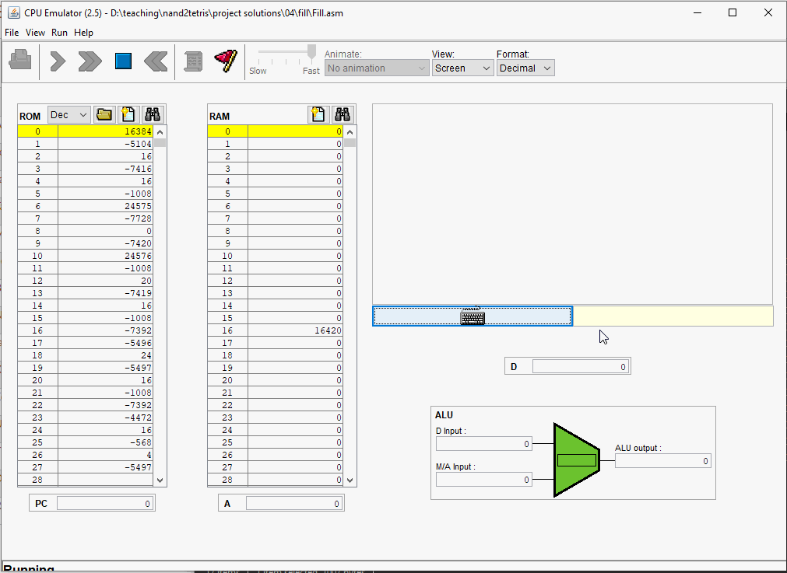
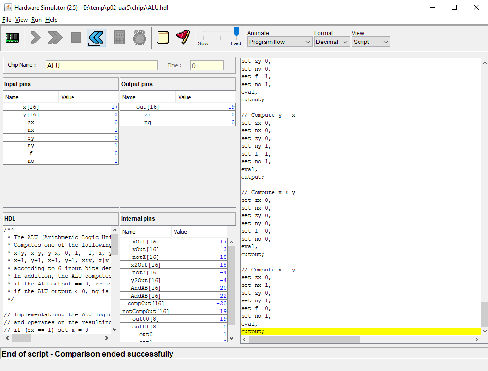

# CS 243 Assignment #1 - Chapter 
1. Complete the project listed at the end of chapter 4 in the book.    
2. Write a program that calculates the Nth Fibonacci number stored in R0.  Store the result in R1.  *_NOTE_* There is no test file for this task.

# Getting Started
Begin by creating a private repository in the course's [GitHub organization](https://github.com/HSU-F20-CS243).
Your repository name **__must__** be in the following format: ```p04-{HSU LOGIN}```.  Thus, my project repository
name would be ```p04-asc564```.  

Once created, your repository should have:
* an "asm" directory that contains your assembly solutions
* a "results" directory that contains screenshots and animated GIFs from the testing results obtained through the CPU simulator
   * For the "fill" program, please uploaded an animated GIF
   * For the "mult" program, please upload a screenshot of the test results
   * For the "Fibonacci" program, please upload an animated GIF of the program running.  The program should show the correct result being calculated in R1.

Below is an example GIF for the "fill" program:


Below is an example static screenshot with test results:


**__NOTICE:__** Failing to set up your repository correctly will result in reduced assignment credit.  

# Design Diary Prompt
Design diaries should be a paragraph or two.  You will be graded on content (i.e. it shows 
deep thought) rather than syntax (e.g. spelling) and structure.  Below are some prompts that can be used to get 
you thinking.  Feel free to use these or to make up your own.
* Describe a particular struggle that you overcame when working on this programming assignment.
* Conversely, describe an issue with your assignment that you were unable to resolve.
* Provide advice to a future student on how he or she might succeed on this assignment.
* Describe the most fun aspect of the assignment.
* Describe the most challenging aspect of the assignment.
* Describe the most difficult aspect of the assignment to understand.
* Provide any suggestions for improving the assignment in the future.

Your design diary will be submitted on canvas and **__should not__** be included in your repository.

# Buddy Report
You will be assigned one or two buddies at the beginning of the assignment.  You are **__not__**
responsible for your buddy's progress.  Rather, the purpose of this is to build your social 
circle and to to give you someone to check in with as you work on your project.  
Give your honest appraisal of each of your buddies' progress:

* Did they seem like they gave a good, honest effort?  
* Did they get stuck somewhere?
* What ideas were shared / what was discussed during your interactions?
* What did you learn from them?
* Anything else you want to add.

A report for each buddy only needs to be a paragraph.  This Buddy Progress Report is _*in no way*_ 
connected to your Buddy's grade.  It is, however, tied to your grade so be sure to provide an accurate report!

Your buddy report will be submitted on canvas and **__should not__** be included in your repository.

# Grading
You will be graded using the following:
* [155 pts] Building programs (see grade sheet in this folder)
* [10 pts] Writing a good design diary
* [5 pts] Writing a good buddy report

# Due Date
This project is due by Midnight on October 1, 2020.  Your repository should contain all code and output files from the test runs provided to you by the book.  On canvas, you will submit your buddy report and design diary.